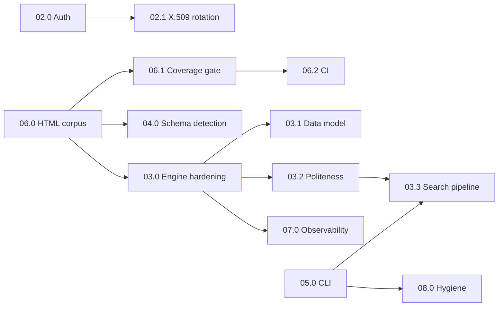

# Milestone 0001 - Generic Implementation

**Package:** `bookscraper` | **Module root:** `src/bookscraper/` | **Tests:** `tests/{unit,mock,integration}/`

Take `bookscraper` from "works on the author's machine for Leanpub" to a generic, production-grade book-metadata
scraper: interchangeable storage backends, deterministic MongoDB Atlas auth with automated X.509 rotation, a hardened
Playwright scraping engine with a canonical data model, AI-assisted selector maintenance, a first-class CLI, and a
test/CI safety net (≥90% coverage, real-HTML mock tests) that lets all of the above change without silent regressions.

Progress lives in [status.md](/docs/roadmap/0001-generic-implementation/status.md). Taxonomy and file conventions:
[docs/roadmap/README.md](/docs/roadmap/README.md).

## Tasks

| Task | Name                                   | Category    | Priority | Depends on       | Output                                                                                                           |
|------|----------------------------------------|-------------|----------|------------------|------------------------------------------------------------------------------------------------------------------|
| 01.0 | Storage backend abstraction            | feature     | P0       | -                | `StorageBackend` contract with `mongo` / `json` backends selected by a required `--store-backend`, plus indexes  |
| 02.0 | MongoDB auth configuration             | feature     | P0       | -                | Deterministic `settings.json` resolver + legacy env fallback, X.509 mechanism diagnostics, honest connect logging |
| 02.1 | X.509 certificate rotation             | feature     | P0       | 02.0             | `bookscraper rotate-cert` via Atlas Admin API (`ATLAS_*`), expiry checks, retention, live re-diagnosis, runbook   |
| 03.0 | Scraping engine hardening              | bugfix      | P0       | 06.0             | Leak-free, typed-result `scrape_book()`; every defined selector (incl. `TAGS`) actually extracted                  |
| 03.1 | Canonical book data model              | feature     | P1       | 03.0             | One `BookRecord` schema across all four sites, ISBN/date normalization, `schema_version`, migration script         |
| 03.2 | Politeness & anti-bot resilience       | feature     | P1       | 03.0             | Per-domain rate limiting, robots.txt, shared backoff/`Retry-After`, bot-wall detection, modern UA handling       |
| 03.3 | Multi-site search pipeline             | feature     | P1       | 03.0, 03.2, 05.0 | `search` works end-to-end for Amazon/Packtpub/O'Reilly, applies `SCRAPE_FILTERS`, cross-site dedup               |
| 04.0 | AI-assisted schema detection           | feature     | P1       | 06.0 (sub. 07)   | `bookscraper detect-schema` (Playwright + Claude), plus model/cost guard, JSON report, golden tests, injection guard |
| 05.0 | CLI improvements                       | feature     | P1       | -                | Shared flags, wired `--max-search-pages`, `--site`/`--query`/`--headless`/`--dry-run`, exit-code contract, `doctor` |
| 06.0 | Real-HTML mock test corpus             | test        | P0       | -                | Captured, sanitized per-site HTML/JSON fixtures served through real Chromium; golden tests for every site          |
| 06.1 | 90% coverage gate                      | test        | P0       | 06.0             | `fail_under = 90` enforced in config, every module ≥90%, accurate coverage docs                                  |
| 06.2 | Continuous integration                 | infra       | P1       | 06.1, 08.0 (01)  | GitHub Actions: ruff, unit+mock with coverage gate, Chromium fixture tier, manual integration tier, dep audit    |
| 07.0 | Observability & run reporting          | feature     | P2       | 03.0             | Secret-redacting log filter, `bookscraper.*` logger hierarchy, machine-readable per-run report                  |
| 08.0 | Repository hygiene & documentation     | chore       | P2       | 05.0             | Correct `requires-python`, dead template scripts removed, README/pyproject/agent-loop docs brought up to date     |

## Execution order

The dependency column is the hard constraint; within it, the recommended order is:

1. **01.0, 02.0, 02.1, 04.0** are largely delivered already - close their remaining ⬜ subtasks opportunistically.
2. **06.0 before 03.0/03.1.** The real-HTML corpus first *characterizes* today's behavior (golden files record what
   `scrape_book()` returns now). Only then do 03.0/03.1 change that behavior, and every changed golden file is a
   reviewed, intentional diff rather than an unnoticed regression.
3. **06.1** immediately after 06.0 (the corpus closes most of the `scrape_details.py` / `search_utils.py` gap).
4. **05.0** in parallel with 03.x - it is CLI-only and unblocks 03.3's `--site` / `--query`.
5. **03.2 → 03.3**: the search pipeline must not fan out to three more sites before politeness exists.
6. **06.2, 07.0, 08.0** last, or whenever a free slot appears.

## Cross-cutting guidelines

Every subtask in this milestone inherits these rules; subtask specs only restate them where a rule is unusually
load-bearing.

- **Coding standard:** [docs/dev/python_coding_standard.md](/docs/dev/python_coding_standard.md) - full type
  annotations on new/changed functions, `ruff` clean under `ruff.toml`, no bare `except:`, `Optional[T]` style.
- **Import direction is one-way:** `commands/` → `scraping/` + `backends/`; `scraping/` → `backends/` (types only) +
  `book_utils.py`; `backends/` → `book_utils.py`. Never the reverse (see CLAUDE.md, *Architecture*).
- **Fail loudly, never guess:** configuration or contract violations raise a named exception
  (`ConfigError`, `RotationError`, `SchemaDetectionError`, …) surfaced through `print_log(..., "error")` and a
  non-zero exit - the same determinism rule as `config.resolve_mongo_connection()`.
- **Propose, never auto-apply:** tooling that suggests changes to `parameters.py` or user config reports them for a
  human to apply (ADR [0002](/docs/adr/0002-ai-assisted-schema-detection.md)).
- **Secrets never leave the process:** no credential, full connection string, Atlas response body, or API key is
  printed, logged, or written to a report. HTTP errors report the status code only.
- **Tests per tier:** pure logic → `tests/unit/`; anything touching Playwright/httpx/pymongo/anthropic →
  `tests/mock/` with the external dependency faked; real services → `tests/integration/` (`@pytest.mark.integration`).
  No test may touch the real `~/.bookscrapper/` or repo-root `books.json` (use `isolated_config` /
  `isolated_local_store` from `tests/conftest.py`).
- **Test documentation:** new tests carry the Scenario/Boundaries/On-failure docstring (`/document-tests`).
- **Verification per subtask:** subtask-scoped `uv run pytest <files> -q`, then `/verify-subtask`, then the applicable
  gates (`/test-gap`, `/dep-audit` on dependency changes, `/secret-scan` on credential-handling code,
  `/link-check docs/` on doc changes).
- **Security-sensitive subtasks** (marked **Role:** *Security Auditor → Python Expert*) get a
  `security-auditor` threat model in `docs/security/` *before* coding starts.

## Definition of done (milestone)

- [ ] Every task row in [status.md](/docs/roadmap/0001-generic-implementation/status.md) is ✅ Complete (minor deferred
      subtasks noted inline are acceptable per the implement-subtasks completion rule).
- [ ] `uv run pytest -m "not integration" --cov=bookscraper` passes with the enforced ≥90% gate, in CI, on every push.
- [ ] `uv run bookscraper search --store-backend json --site amazon --site leanpub --query Python --dry-run` completes
      against live sites without an unhandled exception.
- [ ] The X.509 integration legs either pass without `xfail`, or fail with a recorded, reproducible root cause.
- [ ] CLAUDE.md, README.md, and `docs/` describe the shipped behavior (no stale flags, paths, or thresholds).
